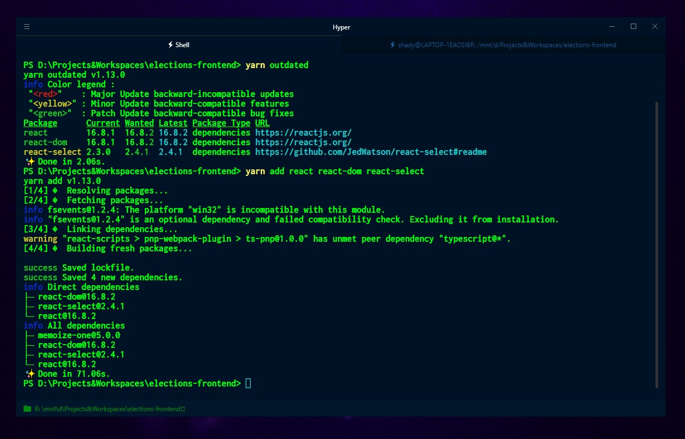

In popular belief, Windows is not preferred to do web development on and for that matter any kind of development. But honestly, this has changed over the years as Windows has matured into what it is today.

> This article assumes you are using Windows 10, however since Windows offers a decent amount of
> backwards compatibility, you should be able to pull this off with an older version of Windows too.

## Terminal

Lets get started with the terminal. The terminal will be extensively used as you will be using a wholesome of different CLIs (Command Line Interfaces, like npm). Primarily you should be using PowerShell and bash (I’ll get to this) with a wrapper like [hyper](https://hyper.is/). Hyper is electron-based terminal built on HTML/CSS/JS. It has loads of extensions to add utility and themes to lavish your experience.



I’ve mentioned the use of bash. Yes, you can install bash on windows and no it’s not a gimmick or some half-baked thing, its the real deal. Meet the Windows Subsystem for Linux (This feature was added to one of the later versions of Windows 10). [Here](https://docs.microsoft.com/en-us/windows/wsl/install-win10) is how to install it. You should use bash whenever PowerShell is giving you unheeded trouble. Remember that when you run bash, its a completely different OS running somewhere on your windows and therefore you need to make fresh installations of all your CLIs using the appropriate commands(depends on which Linux installation you choose).

## Handy Tools

Moving on let’s install a command-line installer. This is quite handy for doing quick installs of different tools. The 2 most popular options on windows are [Scoop](https://scoop.sh/) and [Chocolatey](https://chocolatey.org/). I personally prefer Scoop, because of its more minimal operation, but you couldn’t go wrong with either(installing both is also an option). These let you install things like Node, Python etc. in the blink of an eye.

Next, we need to pick a good web package manager. Again the 2 most popular ones are npm and yarn. npm will be installed by default when you install Node.js. You can install yarn here. Yarn uses npm’s package repository, the only difference being is the way it handles dependencies and its performance (You can read more about the differences on its website). I personally use yarn, but you cannot go wrong with either. There is one more package manager which is not used anymore (but is maintained), but I think I’ll mention it anyway; bower.

Also having Git installed is kind of necessary as it serve as the backbone of most modern web projects and for that matter any development project 😜([Here](https://medium.com/code-dementia/why-and-how-you-should-start-using-git-github-right-now-28617df72545) is a guide on Git and GitHub by Hemant Jain). Finally, you might come across a few errors due to missing build tools. These are the [windows-build-tools](https://www.npmjs.com/package/windows-build-tools), which are some modules necessary for compiling, running and building different stuff. While I’m not clear on exactly what modules this package contains, it has helped me avoid a lot of errors when I was trying out new stuff and is mandatory for a lot of different projects. You can simply install them by running:

```bash
npm install --global windows-build-tools
```

Or, if you are using Yarn:

```bash
yarn global add windows-build-tools
```

## Code Editor

The Code Editor is one of the most important things in web development and as a matter of fact in any kind of development (yes, I have a habit of repeating phrases). Having a seamless experience during coding, debugging can help with all the frustration that comes along with it. Personally, I have used a lot of different code editors, some that come loaded with a plethora of features and some that just have the bare minimum. However, there was only one that stuck; VS Code (abbr. for Visual Studio Code). VS Code comes with a handful features out of the box which should be enough to get you started and as you proceed you can explore its vast extensions marketplace to enhance your experience. VS Code with a good set of extensions can easily replicate a modern full-fledged IDE and all that with exceptional performance. Currently, its the most popular code editor for a lot of different categories of developers and receives new updates and features every month.


Enough VS Code, moving on we have other options like [Atom](https://atom.io/), [Sublime](https://www.sublimetext.com/), [Brackets](http://brackets.io/) and [WebStorm](https://www.jetbrains.com/webstorm/) etc. Atom is very similar to VS Code but the place it lacks mainly is performance, as you load new extensions in Atom, it slows down significantly. WebStorm is an industry level IDE with all the important features out of the box but it is not free (unless you are a student enrolled in a school).

Alternatively, you could also use a Cloud IDE which basically are code editors running on the browsers. They come with a lot of handy features. Some of them are [Code Sandbox](https://codesandbox.io/), [GitPod](https://www.gitpod.io/) and [Coder](https://coder.com/) etc.

## API Tester

Having an API Tester (for REST and GraphQL API’s)is really important as when you develop different API’s for your application in your back-end, the easiest way to test them are these. The 2 most popular ones are [Postman](https://www.getpostman.com/) and [Insomnia](https://insomnia.rest/), the latter also has GraphQL support. I personally use Insomnia due to its easier to use interface and the free themes available. Postman on the other hands has a lot of different team features which are helpful when you are working on large projects with larger teams. You couldn’t go wrong with either of them.

## UI/UX Design

Whether you like it or not, User Interfaces and User experiences are an integral part of web development. When developing the front-end of any web project it some times it helps a lot to start with creating mockups & prototypes of the interface. Some easy (and free) to use tools for this are [Figma](https://www.figma.com/) and [Adobe XD](https://www.adobe.com/in/products/xd.html). I prefer using Figma, mainly because it has an option to easily export the CSS of any object created. Other than that you couldn’t go wrong with either.

## Conclusion

Developing the Web on Windows has never been as easy as it is today, so let go of the myth that only Mac’s and Linux PC’s can do it and start developing on Windows today. 😃
