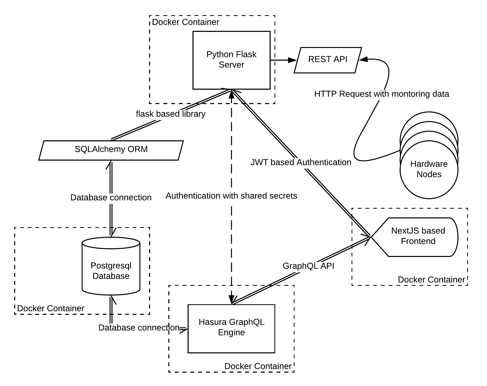

The early platform of Yoctosehns can be divided into 4 services; 2 independent micro frontends one used for statistical calculation and the other for general monitoring built with ReactJS and AngularJS respectively. The other 2 services were a Python Flask based REST API which crudely inserted data on to the final service that is the MySQL Database.

The Flask service had multiple APIs (mostly CRUD) baked into it for fetching data from the database and one rather important API which handled all the HTTP requests from the Hardware nodes to make entries into the database.

Redesigning this was important as having 2 different frontends which easily could have been the same module was difficult to manage. Other than that, since the data was used to perform statistics and advanced monitoring, there was a lot of varied data fetching involved. Creating separate APIs for each of these was difficult.

The new software architecture of Yoctosehns utilizes Microservices architecture. In this architecture, each process is isolated into a different service that that is independent of each other. They communicate with each other through the help of the REST API (Application Programming Interface) and GraphQL API which both leverage the HTTP protocol under the hood.

An architecture diagram to explain it better:

## Python Flask Server

Tools/Technologies used: [Python Flask](https://flask.palletsprojects.com/en/1.1.x/), [Flask CORS](https://flask-cors.readthedocs.io/en/latest/), [Flask SQLAlchemy](https://flask-sqlalchemy.palletsprojects.com/en/2.x/), [Arrow](https://arrow.readthedocs.io/en/latest/), [Flask JWT Extended](https://flask-jwt-extended.readthedocs.io/en/stable/), [Gunicorn](https://gunicorn.org/)

This is the heart/core of the entire system. It handles authentication, requests from the hardware components and inserting the data coming from the hardware nodes into the database. The Arrow library for python is used to manage timestamps and dates in the computations and data storage in the database. Gunicorn is used as the production server for the Flask App and its powerful logging system is leveraged to monitor the different requests coming in from the Hardware nodes.

Its sub-components are:

#### REST API

A very small set of APIs used to handle incoming requests from the Hardware Nodes. REST which stands for Representational state transfer is a software architectural style that defines a set of constraints to be used for creating Web services. Web services that conform to the REST architectural style, called RESTful Web services, provide interoperability between computer systems on the Internet. We use the REST API which is built on top of the HTTP protocol to communicate with the Hardware nodes.

#### Authentication system

The Authentication system facilitates all the authorization processes throughout the platform. It is
a simple JWT (JSON Web Token) based authentication system which handles auth based requests from the frontend and has a shared secret with the Hasura GraphQL Engine. It functions with the use of an access token which is generated using the HS256 encryption algorithm with a secret only known to the backend. The communication happens through a single endpoint based on the REST API explained below leveraging the HTTP protocol.

#### SQLAlchemy ORM

SQLAlchemy ORM (Object-Relationship Mapping) is used to have a well-defined schema using different models corresponding to the tables in the Database. This ORM is also used to handle inserting the monitoring data from the Hardware nodes into the database.

## Hasura GraphQL Engine

Tools/Technologies used: [Hasura](https://hasura.io/)

The Hasura GraphQL Engine coupled with the database form the brain of the system. Hasura is an open-source engine that connects to your databases & microservices and auto-generates a production-ready GraphQL backend. It generates a thorough GraphQL API for all the different tables present in the PostgreSQL database. We can query, mutate, or subscribe to any part of the database using this and it makes fetching varying data a breeze on the frontend. GraphQL is a query language for APIs and a runtime for fulfilling those queries with your existing data. GraphQL provides a complete and understandable description of the data in your API, gives clients the power to ask for exactly what they need and nothing more, makes it easier to evolve APIs over time, and enables powerful developer tools. It also uses the HTTP protocol for communication under the hood.

## PostgreSQL Database

Tools/Technologies used: [PostgreSQL](https://www.postgresql.org/)

Contains all of the data we store from the Hardware Nodes and also computed data of the different statistics we perform on that data in a multitude of different tables. It is connected to the GraphQL Engine using the HTTP and to the Flask based server using the SQLAlchemy ORM.

## Frontend

Tools/Technologies used: [NextJS](https://nextjs.org/), [Apollo GraphQL](https://www.apollographql.com/)

The Frontend handles interface processes, visualization, and interaction with users. It contains a well-organized dashboard with useful insights and monitoring data for the users. The technology used to build this is NextJS (which uses ReactJSs rendering engine) as the main framework and using the sophisticated GraphQL API exposed by Hasura allows for detailed data throughput between the systems.

## Containerization

Tools/Technologies used: [Docker](https://www.docker.com/)

We have used Docker to containerize the entire software stack into multiple different containers i.e one for the database, one for the flask server etc. This allows us with a predictable and safe production environment which is highly scalable.

## Next Steps

The next steps involved adding [NGINX](https://www.nginx.com/) to the mix. NGINX is a load balancer that accelerates content and application delivery, improves security, facilitates availability and scalability. Therefore integrating this would be a big win.
